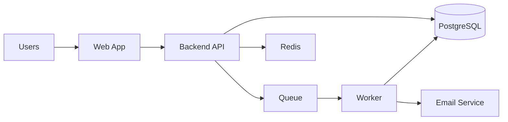

# System Architecture

## 1. Architecture goals
- strong relational data consistency
- clear role based access
- reliable background processing for metrics and alerts
- scalable dashboards without expensive real time recomputation
- clean separation between transactional operations and analytics
- AI agent friendly repository and module layout

## 2. High level architecture



## 3. Main components

### Web app
Recommended: Next.js with App Router and TypeScript.
Responsibilities:
- role based dashboards
- forms and workflows
- charts and tables
- session handling
- optimistic UX where appropriate

### Backend API
Recommended: NestJS for strong structure or FastAPI for rapid implementation.
Responsibilities:
- auth and authorization
- validation
- business rules
- CRUD and workflow endpoints
- audit logging
- aggregation endpoints

### Database
Recommended: PostgreSQL.
Responsibilities:
- transactional source of truth
- relational constraints
- reporting queries
- materialized summaries if needed later

### Queue and worker
Responsibilities:
- compute daily metrics
- detect anomalies
- generate alerts
- send emails
- build cached summary tables

### Email service
Responsibilities:
- transactional email
- alert delivery
- failure retries
- templated emails

## 4. Data flow

### Attendance flow
1. employee checks in
2. API creates attendance session
3. audit log entry written
4. if no check out by threshold, worker generates alert

### Task timer flow
1. employee starts timer
2. API validates no active timer exists
3. time log session starts
4. employee stops timer
5. worker aggregates time into daily metrics

### Project approval flow
1. employee submits project
2. project status = pending_approval
3. manager receives email notification
4. manager approves or rejects
5. audit log records decision
6. project becomes active or rejected

## 5. Suggested services by domain
- AuthService
- UserService
- TeamService
- AttendanceService
- ProjectService
- TaskService
- TimeLogService
- ApprovalService
- MetricsService
- AlertService
- AuditService
- DashboardService
- EmailService

## 6. Authorization model
Use RBAC with optional ownership checks.

Examples:
- only admin can create managers
- managers can create employees in their scope
- employees can only see their own data
- managers can only view employees mapped to their team
- admins can view all records

## 7. Processing strategy

### Synchronous operations
Use for:
- create/update task
- check in/check out
- approve project
- start/stop timer

### Asynchronous operations
Use for:
- email alerts
- daily summaries
- performance scoring
- anomaly detection
- backlog alert sweeps

## 8. Scalability guidance
For MVP:
- compute some summaries in worker jobs
- serve dashboards using summary tables when possible

Do not:
- calculate all metrics live from raw logs on every dashboard load
- mix alert processing inside request handlers
- let charts trigger expensive joins repeatedly

## 9. Logging and observability
- structured server logs
- error tracking
- audit logs for business critical actions
- job monitoring for failed background tasks
- email delivery status tracking

## 10. Recommended folder layout
```text
/apps
  /web
  /api
  /worker
/packages
  /ui
  /types
  /config
  /utils
/docs
/infra
```

## 11. Deployment guidance
- dockerize all services
- use environment based config
- separate staging and production
- protect secrets properly
- enable backups for PostgreSQL
- add health endpoints for API and worker

## 12. Future ready extensions
- SSO
- payroll sync
- export jobs
- multi organization support
- AI insight service
