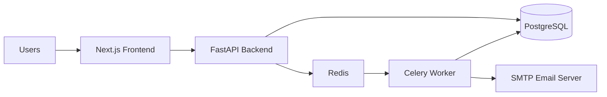

# 03 System Architecture

## Architecture Overview
The system is built as a modern, full-stack application using a monorepo-style structure. It prioritizes relational consistency, role-based security, and background processing for intelligence tasks.

### High-Level Component Diagram


## Technical Stack
*   **Frontend**: Next.js (App Router), TypeScript, Tailwind CSS, shadcn/ui.
*   **Backend**: FastAPI (Python), SQLAlchemy (ORM), Pydantic (Validation).
*   **Database**: PostgreSQL (Production) / SQLite (Local Dev).
*   **Task Queue**: Redis + Celery.
*   **Authentication**: JWT-based with secure refresh tokens.
*   **Deployment**: Railway (Target Platform).

## Monorepo Structure
```text
/HR Monitoring System
  /apps
    /web         # Next.js frontend application
    /api         # FastAPI backend application
  /packages
    /ui          # Shared UI components (if applicable)
    /types       # Shared TypeScript definitions
  /infra         # Infrastructure as code / deployment scripts
  /docs          # Project documentation
```

## Request Lifecycle
1.  **Client Request**: Frontend sends an HTTPS request with a JWT `Authorization` header.
2.  **API Gateway / CORS**: FastAPI handles CORS (restricted to localhost and railway domains).
3.  **Authentication Middleware**: Backend validates the JWT and injects the `current_user` into the request context.
4.  **Route Handler**: Routes use Pydantic schemas for input validation.
5.  **Service Layer**: Business logic is encapsulated in dedicated service classes (e.g., `AttendanceService`, `LeaveService`).
6.  **Database Interaction**: SQLAlchemy handles transactions. Sensitive operations (like Leaves) use atomic `flush()` and `commit()` patterns.
7.  **Background Tasks**: Long-running or non-blocking tasks (email alerts, metric aggregation) are offloaded to Celery via Redis.
8.  **Response**: Standardized JSON response envelope with error code handling.

## Data Consistency Patterns
*   **Atomic Transactions**: Multi-entity creations (e.g., Leave Request + Approval Timeline) are wrapped in a single database transaction.
*   **Constraint Enforcement**: Foreign keys and unique constraints are enforced at the database level to prevent orphaned or duplicate data.
*   **UTC Storage**: All timestamps are stored in UTC and converted to Asia/Karachi (PKT) for user display.

## Security Architecture
*   **Role-Based Access Control (RBAC)**: Enforced via FastAPI dependencies on every protected route.
*   **Scope Isolation**: Service layer ensures users can only access data within their hierarchy or ownership scope.
*   **CORS Protection**: Restricted to trusted origins to prevent CSRF and unauthorized cross-origin requests.
*   **Environment-Based Config**: All secrets (DB URLs, SMTP credentials, API keys) are managed via environment variables.
